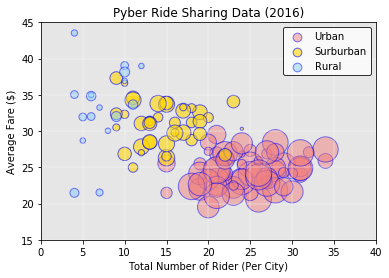
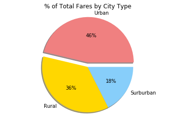
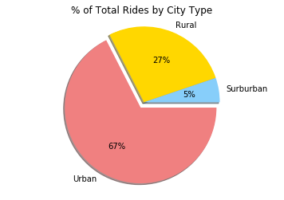
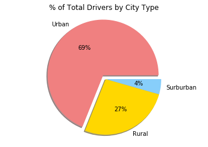

```python
# import dependencies
import pandas as pd
import matplotlib.pyplot as plt
import numpy as np
import seaborn as sns
```


```python
# import first set of data and view
file = '/Users/c_ladd/Desktop/02-Homework/05-Matplotlib/Instructions/Pyber/raw_data/city_data.csv'
city_data = pd.read_csv(file)
city_data.head()
```


<div>
<style scoped>
    .dataframe tbody tr th:only-of-type {
        vertical-align: middle;
    }

    .dataframe tbody tr th {
        vertical-align: top;
    }

    .dataframe thead th {
        text-align: right;
    }
</style>
<table border="1" class="dataframe">
  <thead>
    <tr style="text-align: right;">
      <th></th>
      <th>city</th>
      <th>driver_count</th>
      <th>type</th>
    </tr>
  </thead>
  <tbody>
    <tr>
      <th>0</th>
      <td>Kelseyland</td>
      <td>63</td>
      <td>Urban</td>
    </tr>
    <tr>
      <th>1</th>
      <td>Nguyenbury</td>
      <td>8</td>
      <td>Urban</td>
    </tr>
    <tr>
      <th>2</th>
      <td>East Douglas</td>
      <td>12</td>
      <td>Urban</td>
    </tr>
    <tr>
      <th>3</th>
      <td>West Dawnfurt</td>
      <td>34</td>
      <td>Urban</td>
    </tr>
    <tr>
      <th>4</th>
      <td>Rodriguezburgh</td>
      <td>52</td>
      <td>Urban</td>
    </tr>
  </tbody>
</table>
</div>


```python
# import second set of data and view
file_2 = '/Users/c_ladd/Desktop/02-Homework/05-Matplotlib/Instructions/Pyber/raw_data/ride_data.csv'
ride_data = pd.read_csv(file_2)
ride_data.head()
```


<div>
<style scoped>
    .dataframe tbody tr th:only-of-type {
        vertical-align: middle;
    }

    .dataframe tbody tr th {
        vertical-align: top;
    }

    .dataframe thead th {
        text-align: right;
    }
</style>
<table border="1" class="dataframe">
  <thead>
    <tr style="text-align: right;">
      <th></th>
      <th>city</th>
      <th>date</th>
      <th>fare</th>
      <th>ride_id</th>
    </tr>
  </thead>
  <tbody>
    <tr>
      <th>0</th>
      <td>Sarabury</td>
      <td>2016-01-16 13:49:27</td>
      <td>38.35</td>
      <td>5403689035038</td>
    </tr>
    <tr>
      <th>1</th>
      <td>South Roy</td>
      <td>2016-01-02 18:42:34</td>
      <td>17.49</td>
      <td>4036272335942</td>
    </tr>
    <tr>
      <th>2</th>
      <td>Wiseborough</td>
      <td>2016-01-21 17:35:29</td>
      <td>44.18</td>
      <td>3645042422587</td>
    </tr>
    <tr>
      <th>3</th>
      <td>Spencertown</td>
      <td>2016-07-31 14:53:22</td>
      <td>6.87</td>
      <td>2242596575892</td>
    </tr>
    <tr>
      <th>4</th>
      <td>Nguyenbury</td>
      <td>2016-07-09 04:42:44</td>
      <td>6.28</td>
      <td>1543057793673</td>
    </tr>
  </tbody>
</table>
</div>


```python
# merge both datasets and view the merged dataset
city_ride_data = pd.merge(ride_data, city_data, how="left", on=["city", "city"])
city_ride_data.head()
```


<div>
<style scoped>
    .dataframe tbody tr th:only-of-type {
        vertical-align: middle;
    }

    .dataframe tbody tr th {
        vertical-align: top;
    }

    .dataframe thead th {
        text-align: right;
    }
</style>
<table border="1" class="dataframe">
  <thead>
    <tr style="text-align: right;">
      <th></th>
      <th>city</th>
      <th>date</th>
      <th>fare</th>
      <th>ride_id</th>
      <th>driver_count</th>
      <th>type</th>
    </tr>
  </thead>
  <tbody>
    <tr>
      <th>0</th>
      <td>Sarabury</td>
      <td>2016-01-16 13:49:27</td>
      <td>38.35</td>
      <td>5403689035038</td>
      <td>46</td>
      <td>Urban</td>
    </tr>
    <tr>
      <th>1</th>
      <td>South Roy</td>
      <td>2016-01-02 18:42:34</td>
      <td>17.49</td>
      <td>4036272335942</td>
      <td>35</td>
      <td>Urban</td>
    </tr>
    <tr>
      <th>2</th>
      <td>Wiseborough</td>
      <td>2016-01-21 17:35:29</td>
      <td>44.18</td>
      <td>3645042422587</td>
      <td>55</td>
      <td>Urban</td>
    </tr>
    <tr>
      <th>3</th>
      <td>Spencertown</td>
      <td>2016-07-31 14:53:22</td>
      <td>6.87</td>
      <td>2242596575892</td>
      <td>68</td>
      <td>Urban</td>
    </tr>
    <tr>
      <th>4</th>
      <td>Nguyenbury</td>
      <td>2016-07-09 04:42:44</td>
      <td>6.28</td>
      <td>1543057793673</td>
      <td>8</td>
      <td>Urban</td>
    </tr>
  </tbody>
</table>
</div>


```python
# drop duplicates
city_df = city_data.drop_duplicates('city', keep = 'first')

# group be city name
by_city = city_ride_data.groupby('city')

# var holding avg fare by city
avg_fare = by_city.mean()['fare']

# var holding rides by city
ride_count = by_city['ride_id'].count()

# num of drivers
driver_count = by_city.mean()['driver_count']

# city type data
city_type = city_df.set_index('city')['type']

# dataframe from above series
city_info = pd.DataFrame({
    "Number of Rides": ride_count,
    "Average Fare": avg_fare,
    "Number of Drivers": driver_count,
    "Type of City": city_type
})


city_info.sort_values('Number of Drivers', ascending = False)
city_info.head()
```


<div>
<style scoped>
    .dataframe tbody tr th:only-of-type {
        vertical-align: middle;
    }

    .dataframe tbody tr th {
        vertical-align: top;
    }

    .dataframe thead th {
        text-align: right;
    }
</style>
<table border="1" class="dataframe">
  <thead>
    <tr style="text-align: right;">
      <th></th>
      <th>Average Fare</th>
      <th>Number of Drivers</th>
      <th>Number of Rides</th>
      <th>Type of City</th>
    </tr>
  </thead>
  <tbody>
    <tr>
      <th>Alvarezhaven</th>
      <td>23.928710</td>
      <td>21.0</td>
      <td>31</td>
      <td>Urban</td>
    </tr>
    <tr>
      <th>Alyssaberg</th>
      <td>20.609615</td>
      <td>67.0</td>
      <td>26</td>
      <td>Urban</td>
    </tr>
    <tr>
      <th>Anitamouth</th>
      <td>37.315556</td>
      <td>16.0</td>
      <td>9</td>
      <td>Suburban</td>
    </tr>
    <tr>
      <th>Antoniomouth</th>
      <td>23.625000</td>
      <td>21.0</td>
      <td>22</td>
      <td>Urban</td>
    </tr>
    <tr>
      <th>Aprilchester</th>
      <td>21.981579</td>
      <td>49.0</td>
      <td>19</td>
      <td>Urban</td>
    </tr>
  </tbody>
</table>
</div>


```python
# group the datasets into respective types 
x = city_info['Number of Rides']
y = city_info['Average Fare']

urban = city_info[city_info['Type of City'] == 'Urban']
surburban = city_info[city_info['Type of City'] == 'Suburban']
rural = city_info[city_info['Type of City'] == 'Rural']

```


<div>
<style scoped>
    .dataframe tbody tr th:only-of-type {
        vertical-align: middle;
    }

    .dataframe tbody tr th {
        vertical-align: top;
    }

    .dataframe thead th {
        text-align: right;
    }
</style>
<table border="1" class="dataframe">
  <thead>
    <tr style="text-align: right;">
      <th></th>
      <th>Average Fare</th>
      <th>Number of Drivers</th>
      <th>Number of Rides</th>
      <th>Type of City</th>
    </tr>
  </thead>
  <tbody>
    <tr>
      <th>Alvarezhaven</th>
      <td>23.928710</td>
      <td>21.0</td>
      <td>31</td>
      <td>Urban</td>
    </tr>
    <tr>
      <th>Alyssaberg</th>
      <td>20.609615</td>
      <td>67.0</td>
      <td>26</td>
      <td>Urban</td>
    </tr>
    <tr>
      <th>Antoniomouth</th>
      <td>23.625000</td>
      <td>21.0</td>
      <td>22</td>
      <td>Urban</td>
    </tr>
    <tr>
      <th>Aprilchester</th>
      <td>21.981579</td>
      <td>49.0</td>
      <td>19</td>
      <td>Urban</td>
    </tr>
    <tr>
      <th>Arnoldview</th>
      <td>25.106452</td>
      <td>41.0</td>
      <td>31</td>
      <td>Urban</td>
    </tr>
  </tbody>
</table>
</div>


```python
# create x and y variables for plot
urban_x = urban['Number of Rides']
urban_y = urban['Average Fare']

surburban_x = surburban['Number of Rides']
surburban_y = surburban['Average Fare']

rural_x = rural['Number of Rides']
rural_y = rural['Average Fare']


# plot all three different types onto the graph
plt.scatter(urban_x,urban_y,alpha = 0.5, label = 'Urban', color = 'lightcoral', edgecolor = 'b',s=urban['Number of Drivers']*10)
plt.scatter(surburban_x,surburban_y,alpha = 0.6, label = 'Surburban', color = 'gold', edgecolor = 'b', s = surburban['Number of Drivers']*10)
plt.scatter(rural_x,rural_y,alpha = 0.5, label = 'Rural', color = 'lightskyblue',  edgecolor = 'b', s = rural['Number of Drivers']*10)

# format graph
plt.xlim(0,40)
plt.ylim(15,45)
plt.xlabel('Total Number of Rider (Per City)')
plt.ylabel('Average Fare ($)')
plt.title('Pyber Ride Sharing Data (2016)')
plt.grid(True,color = 'w', linewidth= 0.4)
plt.gca().patch.set_facecolor('0.9')

# format legend
lgnd = plt.legend(frameon = True, edgecolor = 'black')
lgnd.legendHandles[0]._sizes = [75]
lgnd.legendHandles[1]._sizes = [75]
lgnd.legendHandles[2]._sizes = [75]


plt.show()
```





```python
# % of Total Fares by City Type

urban_x_p = urban['Average Fare'].sum()
urban_x_p = urban_x.round(2)

surburban_x_p = surburban['Average Fare'].sum()
surburban_x_p = surburban_x_p.round(2)

rural_x_p = rural['Average Fare'].sum()
rural_x_p = rural_x_p.round(2)

fare_total = [urban_x_p, surburban_x_p, rural_x_p]

# args for pie chart
labels = ['Urban', 'Rural', 'Surburban']
explode = (0.1, 0, 0)
colors = ['lightcoral', 'gold', 'lightskyblue']

# plot pie chart
plt.pie(fare_total, explode = explode, labels = labels, colors = colors, autopct='%.0f%%', shadow=True)
plt.title('% of Total Fares by City Type')
plt.axis('equal')
plt.show()
```





```python
# % of Total Rides by City Type
urban_x_p = urban['Number of Rides'].sum()
urban_x_p = urban_x.round(2)

surburban_x_p = surburban['Number of Rides'].sum()
surburban_x_p = surburban_x_p.round(2)

rural_x_p = rural['Number of Rides'].sum()
rural_x_p = rural_x_p.round(2)

fare_total = [urban_x_p, surburban_x_p, rural_x_p]

# args for pie chart
labels = ['Urban', 'Rural', 'Surburban']
explode = (0.1, 0, 0)
colors = ['lightcoral', 'gold', 'lightskyblue']

#plot pie chart
plt.pie(fare_total, explode = explode, labels = labels, colors = colors, autopct='%.0f%%', shadow=True)
plt.title('% of Total Rides by City Type')
plt.axis('equal')
plt.show()
```





```python
# % of Total Drivers by City Type
urban_x_p = urban['Number of Drivers'].sum()
urban_x_p = urban_x.round(2)

surburban_x_p = surburban['Number of Drivers'].sum()
surburban_x_p = surburban_x_p.round(2)

rural_x_p = rural['Number of Drivers'].sum()
rural_x_p = rural_x_p.round(2)

_total = [urban_x_p, surburban_x_p, rural_x_p]

#args for pie chart
labels = ['Urban', 'Rural', 'Surburban']
explode = (0.1, 0, 0)
colors = ['lightcoral', 'gold', 'lightskyblue']

# plot pie chart
plt.pie(_total, explode = explode, labels = labels, colors = colors, autopct='%.0f%%', shadow=True)
plt.title('% of Total Drivers by City Type')
plt.axis('equal')
plt.show()
```




